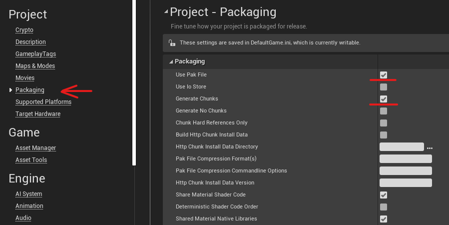

# Project Settings

## 1. Create Project
When you have the engine installed, launch the editor and create a new project.
Call it "Nuts" (This is the internal name for It Takes Two), and change it from Blueprint to C++.

## 2. Settings
Once the editor is up and running, go to: Edit -> Project Settings -> Packaging
Make sure "Use Pak File" and "Generate Chunks" are enabled.

Then go to: Edit -> Editor Preferences.
Search for "Assign Chunk", only one result should show up. Enable this as well.

Now you're able to manually assign a chunk number to what you want to package.
This packages your selected assets into separate chunks, and you can copy the chunk.pak that contains your modded files into the ItTakesTwo\Nuts\Content\Paks folder.
I would recommend making a new folder in here called Mods, and place them all in there.
Also probably a good idea to rename your pak files to something more memorable than "pakchunk-number".

Any custom angelscript files need to go in the ItTakesTwo\Nuts\Script folder.
Again I would recommend making a mod folder in here and keep everything organized.